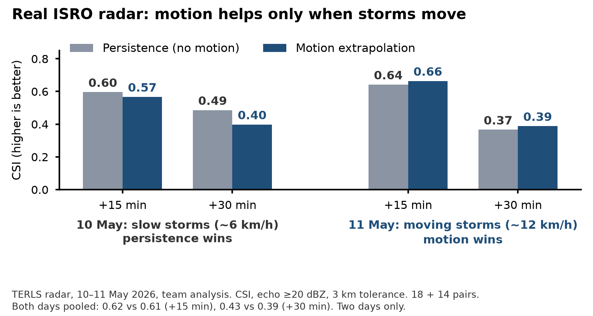

# VajraNow

**A web dashboard that tells officials which storm hazard is coming, where and how precisely, how sure we are, and how many minutes they have.**

Smart India Hackathon 2026 idea by **Team OmniSense** (Team ID 167415).
Problem statement **SIH26084**: Convective scale nowcasting for Thunderstorms, Hail and Cloudbursts (06 hr). Ministry of Earth Sciences. Theme: Disaster Management. Category: Software.

- **Website:** https://vajranow.vercel.app
- **Demo dashboard:** https://vajranow.vercel.app/demo
- **How the engine works:** https://vajranow.vercel.app/method
- **API docs:** https://vajranow.vercel.app/api/py/docs

> **Status: idea stage.** Nothing here is a real forecast or an official IMD warning.
>
> - **Built:** a synthetic engine (tracking, advection, a small CNN trained on synthetic storms, a 20-member ensemble that is not calibrated), the dashboard and the API. All of it runs on **synthetic storms** made in code.
> - **Preliminary evidence:** a two-day baseline on real TERLS radar and INSAT-3DR files (10 and 11 May 2026). **Motion helps when storms move (11 May, ~12 km/h) but not on slow storms (10 May, ~6 km/h). Pooled over both days, motion extrapolation does not beat persistence. So the model must forecast growth and decay, not just motion.** Two days are too few for a general claim. See [Real-data baseline](#real-data-baseline-preliminary).
> - **Planned:** real replay, calibrated hazards, a reliability gate, LightGBM hazard models, a pysteps comparison, CAP export (no agency endorsement implied), a blend with NCMRWF model guidance for 3 to 6 h, archived-file ingestion and authorised live feeds.

## The problem

- Thunderstorms, hail and cloudbursts can build in minutes, over an area only a few kilometres across.
- Current IMD nowcasts are issued per district and station, with a validity time. Officials cannot tell which town is hit first, or when.
- Lightning killed 2,560 people in India in 2023, 39.7% of all deaths from forces of nature (source: NCRB, Accidental Deaths and Suicides in India 2023).

Storms build in minutes, so we nowcast 0–3 h from fresh observations and hand over to NCMRWF model guidance for 3–6 h.

Officials need four answers, fast: **Which hazard? Where, and how precisely? How sure are we? How many minutes do we have?**

## What is in this repo

| Part | What it does | Where |
| --- | --- | --- |
| Website | Landing page and method page | [`app/`](app/) |
| Dashboard | The `/demo` page. Reads everything from the engine API | [`app/demo/`](app/demo/) |
| Engine | Python nowcasting pipeline: quality checks, tracking, extrapolation, small CNN, ensemble, warnings | [`vajranow/`](vajranow/) |
| API | FastAPI app, deployed as a Vercel Python function | [`api/index.py`](api/index.py), [`vajranow/service.py`](vajranow/service.py) |
| CNN training | PyTorch training and evaluation on synthetic storms | [`training/`](training/) |
| Real-data baseline | Persistence vs motion extrapolation on TERLS radar, 10 and 11 May 2026, with inputs listed and results | [`validation/real_radar/`](validation/real_radar/) |
| Tests | Engine, contours, fusion, scenario stories and API | [`tests/`](tests/) |
| Design | Architecture and warning logic | [`design/architecture.md`](design/architecture.md) |
| Requirements coverage | Each required output: status, planned predictors, labels and checks, and a line-by-line check against the problem statement | [`docs/requirements-coverage.md`](docs/requirements-coverage.md) |
| Problem statement | The official SIH26084 text from the portal | [`docs/ps-statement.md`](docs/ps-statement.md) |
| Reliability gate | What "Not reliable" does today, and the proposed skill-based gate | [`docs/reliability-gate.md`](docs/reliability-gate.md) |
| Submission audit | Every deck claim checked against the repo, with status | [`docs/submission-audit.md`](docs/submission-audit.md) |
| Notices | Third-party data, methods, software and template attribution | [`NOTICE.md`](NOTICE.md) |

## How the engine works

On one 2 km grid over south Kerala (the 250 km range of the TERLS Doppler radar). The demo engine steps every 10 minutes on synthetic scans. Real TERLS scans in our files are about 15 minutes apart (median 15.3 min), so the planned real system makes a new run with each scan. Real detail is coarser than 2 km: satellite pixels are about 4 km and the radar beam widens with range.

1. **Quality checks.** Removes ground clutter and speckle, and reports missing radar scans instead of hiding them.
2. **Storm motion.** TREC block matching between consecutive radar scans (30 km blocks, up to about 72 km/h), with a confidence value for every cell.
3. **Extrapolation.** Semi-Lagrangian advection moves storms along the motion. This is the baseline every other step must beat.
4. **Small CNN.** A small neural network (about 17 thousand weights) predicts growth, decay and new storms from radar, infrared cloud-top cooling, lightning and the radar trend. Trained with PyTorch on synthetic storms only, then run in numpy.
5. **Ensemble.** 20 slightly different forecasts plus a control run turn into probabilities. These are not calibrated yet.
6. **Warnings.** IMD colour levels, arrival windows as a range (10th to 90th percentile across the ensemble), unvalidated hail, strong-wind and cloudburst flags, new-storm zones from satellite, and honest "not reliable" labels in hilly terrain or outside radar coverage.
7. **Show.** Warning polygons (marching squares), radar frames, storm tracks with uncertainty cones, and point forecasts for any place on the map.

Every number the engine uses is on the [method page](https://vajranow.vercel.app/method).

### Missing data: what the code does today

- An earlier radar scan is missing: it is reported, and tracking uses the scans that remain.
- The latest radar scan is missing: the engine does not run a nowcast.
- A satellite image more than 20 minutes old is marked stale on the dashboard. Its cloud-top cues are still used.

Planned, not built: a stale-radar flag with no new alerts when radar is lost; satellite initiation cues turned off when satellite is lost; and, when lightning or weather-model feeds are down, running on radar and satellite only with those outputs off and confidence lowered.

## Real-data baseline (preliminary)

A first check on real data, separate from the engine: TERLS radar and INSAT-3DR files from MOSDAC, 10 and 11 May 2026. Team analysis.

**Motion helps when storms move (11 May, ~12 km/h) but not on slow storms (10 May, ~6 km/h). Pooled over both days, motion extrapolation does not beat persistence. So the model must forecast growth and decay, not just motion.**

| Day | Median cell motion | Pairs | +15 min: persistence vs motion | +30 min: persistence vs motion | Better |
| --- | --- | --- | --- | --- | --- |
| 10 May | 6.3 km/h | 18 | 0.596 vs 0.567 | 0.486 vs 0.398 | Persistence |
| 11 May | 12.3 km/h | 14 | 0.642 vs 0.664 | 0.366 vs 0.388 | Motion |
| Both days, pooled | | 32 | 0.62 vs 0.61 | 0.43 vs 0.39 | Persistence (by 0.01 at +15 min) |

CSI = hits / (hits + misses + false alarms), echo of 20 dBZ or more, 3 km tolerance, Farneback optical flow for the motion. Two days are too few for a general claim, and the VajraNow engine has not been run on these files yet.

Scripts, the list of input files, results and how to rerun it: [validation/real_radar/](validation/real_radar/).



### Demo scenarios (all synthetic)

| Scenario | What it shows |
| --- | --- |
| Squall line moving into Kochi | Fast storms (about 38 km/h), a hail signal heading for Kochi Airport, a new cell forming offshore, and a "not reliable" flag for Munnar |
| Afternoon storms over the Western Ghats | Slow storms over Idukki, arrival windows for Kottayam and Pathanamthitta, new storms seen by satellite first, and a missing radar scan |
| Slow heavy-rain cell near Thiruvananthapuram | A back-building storm that may cross the cloudburst threshold (100 mm in an hour) |

Open a scenario directly: `/demo?scenario=ghats-afternoon`.

## API

| Endpoint | Returns |
| --- | --- |
| `GET /api/py/health` | Engine status and version |
| `GET /api/py/v1/scenarios` | The demo scenarios |
| `GET /api/py/v1/nowcast/{scenario}` | Full nowcast: frames, warning polygons, storm cells, arrival windows, alerts, feed status |
| `GET /api/py/v1/nowcast/{scenario}/point?lon=&lat=` | Forecast for any point: level by lead time, probabilities, arrival window |
| `GET /api/py/v1/method` | Thresholds and rules, for transparency |

```bash
curl "https://vajranow.vercel.app/api/py/v1/nowcast/kochi-squall/point?lon=76.40&lat=10.15"
```

Full reference: [docs/api.md](docs/api.md).

## Run it locally

Needs Node.js 20+ and Python 3.12+.

```bash
npm install
pip install -r requirements-dev.txt

npm run dev:api   # engine API on http://127.0.0.1:8000
npm run dev       # website on http://localhost:3000 (forwards /api/py to the engine)
```

Checks:

```bash
python -m pytest     # engine, fusion, scenario and API tests
npm run lint
npm run build
```

Retrain the fusion step (optional, needs PyTorch):

```bash
pip install torch --index-url https://download.pytorch.org/whl/cpu
python training/train_fusion.py --train 700 --val 80 --epochs 60
python training/evaluate.py --n 40
```

## Deployment

Vercel builds the Next.js site and the Python function from the same repo:

- `next.config.ts` forwards `/api/py/*` to the Python function `api/index.py` on Vercel, and to the local engine in development.
- `vercel.json` keeps the Next.js build and `node_modules` out of the Python bundle.
- `requirements.txt` holds the runtime dependencies (FastAPI, numpy) and `.python-version` pins Python 3.13.
- Engine responses are cached by Vercel's CDN for each deployment and cleared on every new deploy.

## Hazards

None of these is validated. Each is labelled with what it is today. The **next** column is planned, not built: it uses the 3D TERLS volume (81 levels, 250 m apart) and the radial velocity (`VEL`) field that are already in our radar files.

| Hazard | In the demo today | Next (planned, not built) | Status |
| --- | --- | --- | --- |
| Lightning | Chance of echo of 40 dBZ or more (radar proxy) | Echo of 35 dBZ or more at the −10 °C level (temperature from ERA5), then IITM flash data as labels | Proxy |
| New storms forming | Satellite cloud-top cooling where radar sees little yet | Checked against later radar echoes | Demo |
| Hail | Flag where echo reaches 55 dBZ; kept out of the alert levels | 45 dBZ echo at least 1.4 km above the freezing level (Waldvogel criterion), plus VIL and echo-top height | Flag |
| Downburst / damaging gusts | Strong-wind proxy: a cell of 50 dBZ or more moving 30 km/h or faster; kept out of the alert levels | Low-level radial-velocity divergence from `VEL` (in our files, not yet processed) | Proxy |
| Extreme rain / cloudburst | Radar rain of 50 mm and 100 mm or more in an hour, estimated with Z = 300 R^1.4 (100 mm/h is the cloudburst threshold as widely reported) | Rain-gauge check | Experimental |

How each will be built and checked (planned predictors, labels and verification): [docs/requirements-coverage.md](docs/requirements-coverage.md).

## Data sources

| Source | What it gives | Access |
| --- | --- | --- |
| TERLS radar | 3D reflectivity + velocity, ~15 min scans. Reflectivity used so far; velocity not yet processed | MOSDAC: 2 days (10–11 May 2026) in hand, more ordered |
| INSAT-3DR | Infrared cloud tops, 30 min frames | MOSDAC: in hand, more ordered |
| Cherrapunji radar | MOSDAC files we hold for 10 and 12 May 2026 | Planned second region for cloudburst work; not used yet |
| ISS-LIS | Lightning flashes, spot checks only | NASA Earthdata, free |
| IITM lightning | Strike locations, 80+ sensors | To request |
| ERA5 / NCMRWF | Instability, freezing level, wind. ERA5 for past cases; NCMRWF model forecasts for 3–6 h | ERA5 open; NCMRWF to request |
| Live IMD radar | Live runs | Needs IMD approval |

How to get each one: [docs/data-sources.md](docs/data-sources.md).
**No MOSDAC or IMD data is stored in this repo.** Their terms do not allow redistribution.

## Tech stack

| Part | Tools |
| --- | --- |
| Engine | Python, numpy (tracking, extrapolation, ensemble, contours), FastAPI |
| Small CNN | PyTorch for training, numpy for running |
| Real-data baseline | numpy, OpenCV, netCDF4, h5py, matplotlib |
| Planned | pysteps comparison, LightGBM hazard models with calibration, PostGIS, archived MOSDAC file ingestion, CAP export, NCMRWF model blend for 3 to 6 h |
| Frontend | Next.js, MapLibre GL JS, Tailwind CSS, Framer Motion |
| Hosting | Vercel (site and Python function) |

## Roadmap

1. **Now:** synthetic engine, dashboard and API; a two-day real-data baseline.
2. **Real replay:** archived-file ingestion for TERLS radar and INSAT-3D/3DR; replay past Kerala storms; compare with persistence and pysteps.
3. **Calibrated hazards:** LightGBM hazard models with calibrated probabilities, a daily scorecard and a skill-based reliability gate; a blend with NCMRWF model guidance for 3 to 6 h.
4. **CAP export and live feeds:** CAP export for authorised official dissemination (no agency endorsement implied); live runs only after IMD and IITM approval.

## Intended benefits

These are intended outcomes. None has been measured.

| | Intended benefit | How we would measure it |
| --- | --- | --- |
| Social | Fewer lightning deaths; safer schools and outdoor workers | Warning minutes per test storm |
| Economic | Less crop and equipment damage; response teams sent where needed | Operational proxy: false-alert rate per district per season. This is not damage avoided. |
| Operational | Earlier, place-specific decisions | Minutes of lead time gained over the baseline |

## Responsible use

- VajraNow is a **decision-support prototype. It is not an official IMD warning.** Official warnings come only from IMD.
- The engine runs on synthetic storms. The only real-data result is the two-day baseline above, where motion extrapolation did not beat persistence.
- Scores on synthetic storms are used only inside the tests to stop changes that make things worse than the baseline; they are never published as accuracy.
- Places where timing cannot be trusted (hilly terrain with low tracking confidence, or outside radar coverage) are marked as such instead of showing a confident time.
- Planned CAP export is for authorised official channels. No agency endorsement is implied.
- We follow the terms of every data provider and do not redistribute restricted data. The MOSDAC files used for the baseline are listed in `validation/real_radar/input_manifest.csv` but not stored here.

## Team OmniSense

| Name | Role |
| --- | --- |
| Agam Sharma | Team leader |
| Abdeali Jhabuawala | Member |
| Samar Kuril | Member |
| Krish Patel | Member |
| Vipul Singh Adhikari | Member |
| Pritika Pangotra | Member |

## Licence

[MIT](LICENSE) for our code. Third-party data, methods, software and the deck template keep their own terms: see [NOTICE.md](NOTICE.md).
