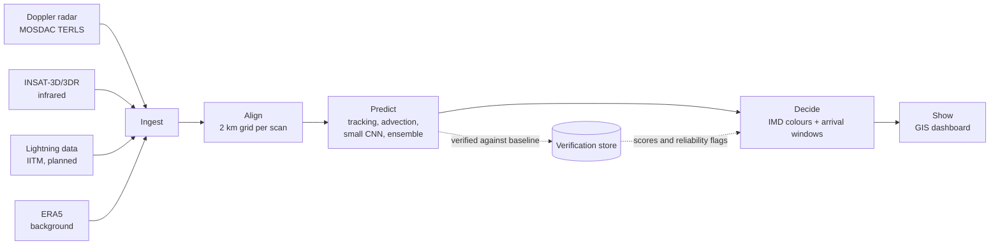

# Imperial-X architecture

**Status: the engine runs on synthetic storms.** Archived-file ingestion, training on real storms and authorised live feeds are still planned. A separate two-day baseline on real TERLS radar found that motion helps when storms move (11 May) but not on slow storms (10 May); pooled, motion extrapolation does not beat persistence, so the model must forecast growth and decay ([validation/real_radar](../validation/real_radar/)). No hazard skill numbers exist yet.

Code map: each stage below is a module in [`imperial_x/`](../imperial_x/README.md). The API is [`imperial_x/service.py`](../imperial_x/service.py), served by [`api/index.py`](../api/index.py).

## 1. The flow

## 2. Stages

| Stage | What it does | Planned tools | Folder |
| --- | --- | --- | --- |
| Ingest | Today: synthetic radar, infrared and lightning, with quality checks for clutter, speckle and missing scans. Planned: reading MOSDAC radar and INSAT-3D/3DR files. | Python, numpy | `imperial_x/synthetic.py`, `qc.py`, `observe.py` |
| Align | Puts every input on one 2 km grid over the radar area. The demo steps every 10 minutes on synthetic scans; real TERLS scans are about 15 minutes apart. Planned: parallax fix for satellite. | Python, numpy | `imperial_x/grid.py` |
| Predict | TREC motion tracking, semi-Lagrangian extrapolation (the baseline), a small CNN for growth, decay and new storms (trained on synthetic storms), and a 20-member ensemble (uncalibrated). Planned: comparison with pysteps. | numpy, PyTorch (training only) | `imperial_x/motion.py`, `advection.py`, `fusion.py`, `ensemble.py`, `training/` |
| Decide | IMD levels from probabilities, arrival windows as a range, unvalidated hail (55 dBZ flag), strong-wind proxy and cloudburst (experimental Z-R) flags, new-storm zones, "not reliable" flags. Planned: LightGBM hazard models with calibration, and a reliability gate. | numpy | `imperial_x/hazards.py`, `decide.py` |
| Show | Warning polygons, radar frames and point forecasts served to the dashboard. Planned: PostGIS for history, a scorecard, and CAP export for authorised official channels (no agency endorsement implied). | FastAPI, Next.js, MapLibre | `imperial_x/contour.py`, `render.py`, `service.py`, `app/demo/` |

## 3. Grid and timing

- **Grid:** 2 km cells, covering the TERLS radar range over Kerala first.
- **Cycle:** the demo engine steps every 10 minutes on synthetic scans. The planned real system makes a new run with each radar scan, about every 15 minutes.
- **Lead times:**
  - 0 to 1 h: sharp 2 km hazard map.
  - 1 to 3 h: probability zones (coarser, with chance of each hazard).
  - 3 to 6 h: broad area outlook only. Planned: blend with NCMRWF model guidance (0–3 h nowcast from fresh observations, hand-over to NCMRWF for 3–6 h).

The further ahead, the less detail we show. This is on purpose: skill drops quickly with lead time for small storms.

## 4. Warning logic (Decide)

1. For each place of interest (airport, town, dam), find the first time the forecast hazard level there reaches Orange or Red.
2. Run the same check with the storm moving faster and slower (a speed range) to get the **arrival window**, for example "25 to 40 min".
3. If motion is unclear, the terrain is complex (for example the Western Ghats), or the models disagree, show **"Not reliable"** instead of a time.
4. Colours follow the IMD scheme: Green (no warning), Yellow (be updated), Orange (be prepared), Red (take action).

The engine implements these steps in `imperial_x/decide.py`, using the 20 ensemble members for the window.

## 5. Verification

- Scores in `imperial_x/verify.py`: probability of detection, false alarm ratio, critical success index, and the fractions skill score.
- Today: every change is checked against plain extrapolation and persistence on held-out synthetic storms inside the test suite. These scores are never published as accuracy.
- Preliminary: on real TERLS radar for 10 and 11 May 2026 (32 forecast pairs), CSI at 20 dBZ with 3 km tolerance was 0.62 (persistence) vs 0.61 (motion) at +15 min and 0.43 vs 0.39 at +30 min. See [validation/real_radar](../validation/real_radar/).
- Planned: the same comparison, plus the pysteps baseline and arrival-time errors, on past Kerala storm cases from MOSDAC data. Results will feed back into Decide as a reliability gate.

## 6. Data rules

- No MOSDAC or IMD data is stored in the repo or on the website. Their terms do not allow redistribution.
- Downloads live in a local `data/` folder, which is in `.gitignore`.
- Live operation only with IMD approval and partnership.
- Missing feeds today: a missing earlier radar scan is reported and tracking uses the rest; a missing latest scan stops the nowcast; a satellite image over 20 minutes old is marked stale but still used. The radar-lost and satellite-lost modes in the deck are planned.

See [docs/data-sources.md](../docs/data-sources.md) for how each dataset is obtained.
