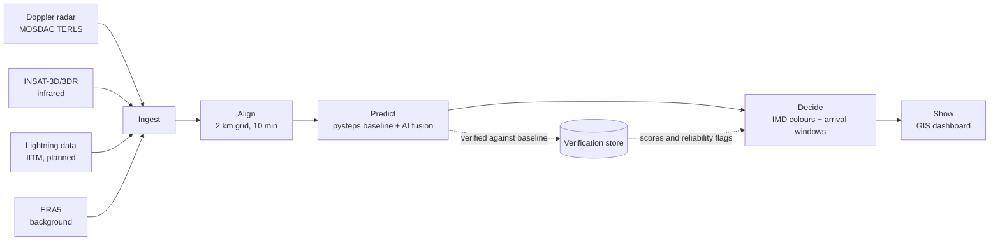

# VajraNow architecture

**Status: the engine runs end to end on synthetic storms.** Real MOSDAC ingestion, training on real storms and live operation are still planned. No accuracy numbers are published; they will only come from real storm cases.

Code map: each stage below is a module in [`vajranow/`](../vajranow/README.md). The API is [`vajranow/service.py`](../vajranow/service.py), served by [`api/index.py`](../api/index.py).

## 1. The flow

## 2. Stages

| Stage | What it does | Planned tools | Folder |
| --- | --- | --- | --- |
| Ingest | Today: synthetic radar, infrared and lightning, with quality checks for clutter, speckle and missing scans. Planned: reading MOSDAC radar and INSAT-3D/3DR files. | Python, numpy | `vajranow/synthetic.py`, `qc.py`, `observe.py` |
| Align | Puts every input on one 2 km grid over the radar area, every 10 minutes. | Python, numpy | `vajranow/grid.py` |
| Predict | TREC motion tracking, semi-Lagrangian extrapolation (the baseline), a fusion network for growth, decay and new storms, and a 20-member ensemble. Planned: comparison with pysteps. | numpy, PyTorch (training only) | `vajranow/motion.py`, `advection.py`, `fusion.py`, `ensemble.py`, `training/` |
| Decide | IMD levels from probabilities, arrival windows as a range, hail, gust and cloudburst flags (experimental), new-storm zones, "not reliable" flags. Planned: LightGBM hazard models. | numpy | `vajranow/hazards.py`, `decide.py` |
| Show | Warning polygons, radar frames and point forecasts served to the dashboard. Planned: PostgreSQL with PostGIS for history. | FastAPI, Next.js, MapLibre | `vajranow/contour.py`, `render.py`, `service.py`, `app/demo/` |

## 3. Grid and timing

- **Grid:** 2 km cells, covering the TERLS radar range over Kerala first.
- **Cycle:** a new nowcast every 10 minutes.
- **Lead times:**
  - 0 to 1 h: sharp 2 km hazard map.
  - 1 to 3 h: probability zones (coarser, with chance of each hazard).
  - 3 to 6 h: broad area outlook only.

The further ahead, the less detail we show. This is on purpose: skill drops quickly with lead time for small storms.

## 4. Warning logic (Decide)

1. For each place of interest (airport, town, dam), find the first time the forecast hazard level there reaches Orange or Red.
2. Run the same check with the storm moving faster and slower (a speed range) to get the **arrival window**, for example "25 to 40 min".
3. If motion is unclear, the terrain is complex (for example the Western Ghats), or the models disagree, show **"Not reliable"** instead of a time.
4. Colours follow the IMD scheme: Green (no warning), Yellow (be updated), Orange (be prepared), Red (take action).

The engine implements these steps in `vajranow/decide.py`, using the 20 ensemble members for the window.

## 5. Verification

- Scores in `vajranow/verify.py`: probability of detection, false alarm ratio, critical success index, and the fractions skill score.
- Today: every change is checked against plain extrapolation and persistence on held-out synthetic storms inside the test suite. These scores are never published as accuracy.
- Planned: the same comparison, plus the pysteps baseline and arrival-time errors, on past Kerala storm cases from MOSDAC data. Results will feed back into Decide as reliability flags.

## 6. Data rules

- No MOSDAC or IMD data is stored in the repo or on the website. Their terms do not allow redistribution.
- Downloads live in a local `data/` folder, which is in `.gitignore`.
- Live operation only with IMD approval and partnership.

See [docs/data-sources.md](../docs/data-sources.md) for how each dataset is obtained.
