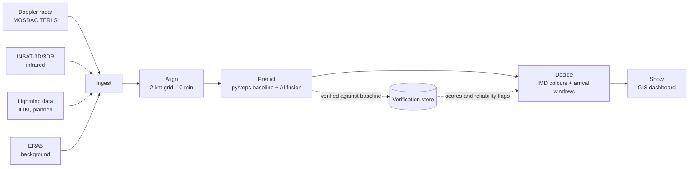

# VajraNow architecture (planned)

**Status: design only.** Nothing below is built yet except the website and the synthetic `/demo`. No accuracy numbers exist, and none will be published until they are measured on real storm cases.

## 1. The flow

## 2. Stages

| Stage | What it does | Planned tools | Folder |
| --- | --- | --- | --- |
| Ingest | Pulls new radar volumes, satellite images and lightning strikes. Checks for missing or late files. | Python, cron / scheduler | `data_pipeline/` |
| Align | Puts every input on one 2 km grid over the radar area, every 10 minutes. Removes radar clutter. | Python, xarray, pysteps utilities | `data_pipeline/` |
| Predict | Baseline: pysteps optical flow extrapolation of radar reflectivity. Fusion: a PyTorch model that adds satellite cloud top cooling and lightning to predict growth and new cells. | pysteps, PyTorch | `models/` |
| Decide | Turns forecast fields into hazard levels (IMD Green, Yellow, Orange, Red), arrival windows with a +/- range, and "not reliable" flags. Hail, gusts and cloudburst use LightGBM classifiers (experimental). | Python, LightGBM | `models/` |
| Show | Serves results to the dashboard and draws them on the map. | FastAPI, PostgreSQL + PostGIS, Next.js, MapLibre | `api/`, `app/` |

## 3. Grid and timing

- **Grid:** 2 km cells, covering the TERLS radar range over Kerala first.
- **Cycle:** a new nowcast every 10 minutes.
- **Lead times:**
  - 0 to 1 h: sharp 2 km hazard map.
  - 1 to 3 h: probability zones (coarser, with chance of each hazard).
  - 3 to 6 h: broad area outlook only.

The further ahead, the less detail we show. This is on purpose: skill drops quickly with lead time for small storms.

## 4. Warning logic (Decide)

1. For each place of interest (airport, town, dam), find the first time the forecast hazard level there reaches Orange or Red.
2. Run the same check with the storm moving faster and slower (a speed range) to get the **arrival window**, for example "25 to 40 min".
3. If motion is unclear, the terrain is complex (for example the Western Ghats), or the models disagree, show **"Not reliable"** instead of a time.
4. Colours follow the IMD scheme: Green (no warning), Yellow (be updated), Orange (be prepared), Red (take action).

The `/demo` page runs a simple version of steps 1 to 3 on a made-up storm (`lib/storm.ts`).

## 5. Verification (planned)

- Every model is compared with the pysteps baseline on the same past storm cases.
- Planned scores: probability of detection, false alarm ratio, critical success index, and timing error of arrival windows.
- Results feed back into Decide as reliability flags, so places or situations where we do badly are marked "Not reliable".

## 6. Data rules

- No MOSDAC or IMD data is stored in the repo or on the website. Their terms do not allow redistribution.
- Downloads live in a local `data/` folder, which is in `.gitignore`.
- Live operation only with IMD approval and partnership.

See [docs/data-sources.md](../docs/data-sources.md) for how each dataset is obtained.
