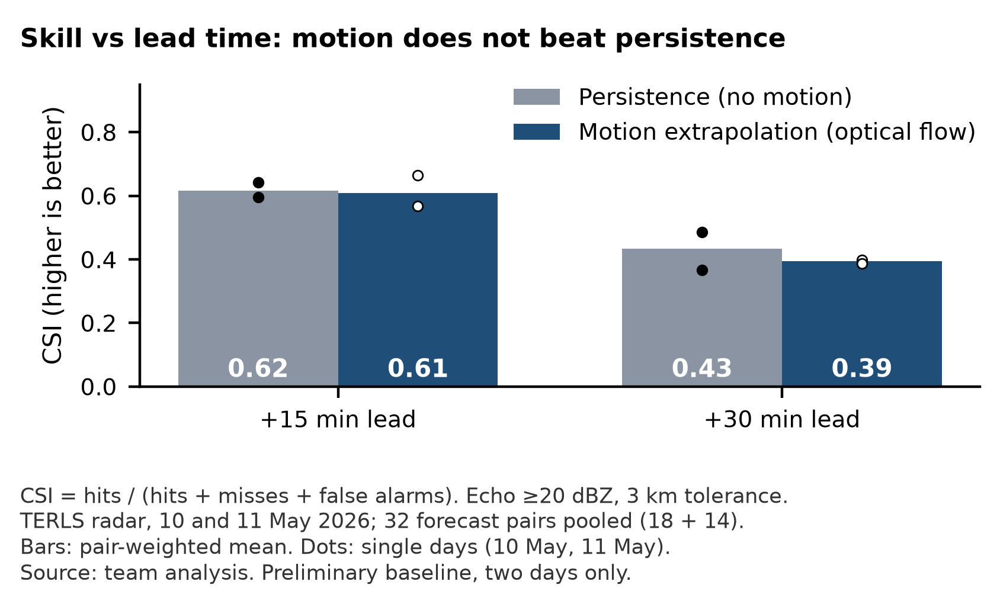
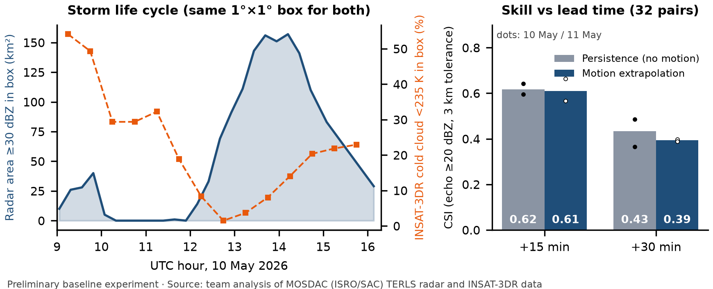

# Real-radar baseline (preliminary, two days)

A first check of the forecast idea on real data: TERLS Doppler radar and INSAT-3DR satellite
files from MOSDAC, 10 and 11 May 2026.

**Result: motion helps when storms move (11 May, ~12 km/h) but not on slow storms (10 May,
~6 km/h). Pooled over both days, motion extrapolation does not beat persistence. So the model
must forecast growth and decay, not just motion.** The pooled result is a negative finding and
we keep it as one. Two days are too few for a general claim. This is team analysis, not an
official result.

| Day | Median cell motion | Pairs | +15 min: persistence vs motion | +30 min: persistence vs motion | Better |
| --- | --- | --- | --- | --- | --- |
| 10 May | 6.3 km/h | 18 | 0.596 vs 0.567 | 0.486 vs 0.398 | Persistence |
| 11 May | 12.3 km/h | 14 | 0.642 vs 0.664 | 0.366 vs 0.388 | Motion |
| Both days, pooled | | 32 | 0.62 vs 0.61 | 0.43 vs 0.39 | Persistence (by 0.01 at +15 min) |

CSI at echo >=20 dBZ with 3 km tolerance; the pooled row is pair-weighted over both days.
Median cell motion: for each pair of scans, the median optical-flow speed of echo pixels
(>=20 dBZ), then the median over the day's scan pairs (`skill.py`, 1 pixel taken as 1 km).
Every number is in [`skill_results.json`](skill_results.json), including the score of every
single pair.






This baseline is separate from the Imperial-X engine in [`imperial_x/`](../../imperial_x/). The engine
runs on synthetic storms only and has not been run on these files.

## What is in this folder

| File | What it is |
| --- | --- |
| `composite.py` | Step 1. Radar volume to cleaned column-maximum map, per scan |
| `skill.py` | Step 2. Persistence and motion forecasts, CSI scores |
| `sat_cold_cloud.py` | Step 3. INSAT-3DR cold cloud tops over the radar area |
| `make_figure.py` | Step 4. Two-panel figure: storm life cycle and skill |
| `make_skill_figure.py` | Step 5. Pooled skill figure (deck V3) |
| `make_day_figure.py` | Step 6. Skill by day, used on the deck (V4), README and website |
| `common.py` | Shared helpers: finding files, reading times, manifest |
| `input_manifest.csv` | Every input file: date, time (UTC), size, SHA-256, used or skipped |
| `skill_results.json` | All scores: per day, pooled, and per pair |
| `sat_cold_cloud.json` | Cold cloud fraction per satellite image |
| `figures/` | The three figures above |
| `requirements.txt` | Pinned Python packages |

## Run it

Needs Python 3.12+ and the MOSDAC files listed in [`input_manifest.csv`](input_manifest.csv).

### 1. Get the input files (not in this repo)

The raw files are not committed. MOSDAC terms do not allow redistribution. Order them from
[MOSDAC](https://www.mosdac.gov.in) (free account):

- **Radar:** TERLS DWR 3D volumetric gridded product, L2C, 10 May 2026 (09:03 to 16:08 UTC)
  and 11 May 2026 (10:11 to 14:55 UTC). Files are named `RCTLS_DDMMMYYYY_HHMMSS_L2C_STD.nc`.
  44 files.
- **Satellite:** INSAT-3DR Imager L1B standard full disk, 10 May 2026, 09:15 to 15:45 UTC,
  every 30 min. Files are named `3RIMG_DDMMMYYYY_HHMM_L1B_STD_V01R00.h5`. 14 files.

Scans used: **10 May, 25 scans** (09:03 to 16:08 UTC); **11 May, 18 scans** (10:11 to 14:40 UTC;
a 19th file, 14:55, is truncated and skipped). That gives 18 pairs on 10 May and 14 on 11 May
at each lead.

We also hold Cherrapunji radar files (`RSCHR_*_L2B_STD.nc`, 10 and 12 May 2026). They are not
used in this baseline or anywhere in the repo.

Put them in `validation/real_radar/data/` (any sub-folders are fine). That folder is git
ignored. Or leave them where they are and pass `--data DIR [DIR ...]` to steps 1 and 3.
Compare your files with the SHA-256 column of `input_manifest.csv` to be sure they are the
same files.

### 2. Run the steps in order

From this folder:

```bash
python -m venv .venv
# Windows: .venv\Scripts\activate    macOS/Linux: source .venv/bin/activate
pip install -r requirements.txt

python composite.py            # or: python composite.py --data /path/to/mosdac
python skill.py
python sat_cold_cloud.py       # or: python sat_cold_cloud.py --data /path/to/mosdac
python make_figure.py
python make_skill_figure.py
python make_day_figure.py
```

`composite.py` takes about a minute for the 44 radar files. The other steps take seconds.

### Expected output

- `work/composites.npz`: 43 cleaned maps (git ignored, rebuilt by step 1)
- `input_manifest.csv`: 58 rows (44 radar, 14 satellite); one radar file skipped
- `skill_results.json`: `headline` shows 32 pairs, 0.62 / 0.61 at +15 min and 0.43 / 0.39 at +30 min
- `sat_cold_cloud.json`: 14 images
- `figures/terls-may10-11.png`, `figures/skill_only.png` and `figures/skill_by_day.png`
- `../../public/real-data/skill-by-day.png` (the website copy, written by step 6)

`skill.py` prints the headline numbers at the end. If yours differ, check the SHA-256 values
first, then the package versions.

## Input data

### Radar: TERLS (RCTLS in MOSDAC file names)

Read from the file metadata of `RCTLS_10MAY2026_090309_L2C_STD.nc`:

| Item | Value |
| --- | --- |
| Product | "3D Volumetric Gridded RCTLS DWR Data", Space Applications Centre, ISRO (CF-1.7 netCDF) |
| Radar | "ISRO RCTLS C-Band DWR (dprf mode)" (file `source`); the grid centre is the TERLS site at Thumba, Thiruvananthapuram |
| Grid | 481 x 481 points, latitude 6.371 to 10.712 N, longitude 74.687 to 79.024 E, step about 0.009 deg (about 1 km); centre 8.54 N, 76.86 E |
| Heights | 81 levels, 0 to 20 km, every 250 m |
| Variables | `DBZ` (reflectivity, dBZ) and `VEL` (radial velocity, m/s), shape (time, height, lon, lat), fill value -999. Only `DBZ` is used. |
| Time per file | One time per file in the `time` variable, units "minutes since <scan time>" (for example "minutes since 2026-05-10 09:03:09"), value 0. The same time is in the file name. |

### Satellite: INSAT-3DR Imager L1B

| Item | Value |
| --- | --- |
| Product | INSAT-3DR Imager, L1B standard, full disk (HDF5) |
| Band used | TIR1 (10.8 um) counts, converted to brightness temperature with the `IMG_TIR1_TEMP` lookup table in the file. About 4 km pixels |
| Geolocation | `Latitude` and `Longitude` datasets, int16 scaled by 0.01 |
| Time per file | `Acquisition_Time_in_GMT` (for example 0915), the same as the file name. The full disk scan runs about 27 min from there (`Acquisition_Start_Time` to `Acquisition_End_Time`, also in the manifest) |

### Time zone

The radar files store no time zone: the `time` units say "minutes since 2026-05-10 09:03:09"
with nothing after it. **We read radar times as UTC.** The satellite files say GMT. This is
an assumption, not a fact from the radar files.

## Method

### Step 1: radar composite (`composite.py`)

For each radar file, at each height level:

1. Drop values above 65 dBZ (not plausible rain echo here).
2. Drop isolated pixels: a valid pixel is kept only if at least 2 of its 8 neighbours at the
   same height are valid.
3. Take the maximum over height (column maximum).

### Step 2: forecasts and scores (`skill.py`)

- **Persistence:** the forecast is the latest scan, unchanged.
- **Motion extrapolation:** OpenCV Farneback optical flow between the previous scan and the
  latest scan (both smoothed with a Gaussian of 2 pixels, reflectivity clipped to 0 to 60 dBZ;
  pyramid scale 0.5, 3 levels, window 25, 3 iterations, poly_n 5, poly_sigma 1.1). The latest
  scan is moved along that flow, scaled to the forecast lead (bilinear remap). No growth or
  decay.
- **Leads:** one scan ahead ("+15 min") and two scans ahead ("+30 min"). These are nominal.
  The median scan spacing is **15.3 min**; actual leads are about 15 to 18 min for one scan and
  about 30 to 40 min for two scans. Each pair's actual lead is in `skill_results.json`.
- **Score:** CSI = hits / (hits + misses + false alarms), on echo **>= 20 dBZ** (headline) and
  >= 30 dBZ. The headline uses a **3 km tolerance**, done by dilation with a 7 x 7 pixel
  square (3 pixels each side, about 3 km):
  - hit: an observed echo pixel with a forecast echo pixel within 3 km
  - miss: an observed echo pixel with no forecast echo pixel within 3 km
  - false alarm: a forecast echo pixel with no observed echo pixel within 3 km
  
  Scores with no tolerance (pixel by pixel) are also in `skill_results.json`.

### Pair rules

A pair is (previous scan, latest scan, target scan) on the same day. It is used only if:

- the previous and latest scans are at most 20 min apart (needed for the motion),
- the latest and target scans are at most 20 min apart for "+15 min", at most 40 min apart for
  "+30 min",
- the latest scan or the target scan has at least 5 echo pixels at the threshold.

Days are never mixed. With these rules there are 18 pairs on 10 May and 14 on 11 May at each
lead, **32 in total** (>= 20 dBZ, 3 km). The pair lists for each lead are in
`skill_results.json` under `pairs`.

### Pooling

Pair-weighted: the mean CSI over all 32 pairs, which equals each day's mean weighted by its
number of pairs (18 and 14). The dots in the figures are the single-day means.

### Missing data

- **Unreadable file:** `RCTLS_11MAY2026_145558_L2C_STD.nc` is truncated (79 MB instead of
  150 MB) and cannot be read. It is skipped and marked as skipped in the manifest.
- **Gaps between scans:** 10 May has gaps of 21.7 min (14:42 to 15:04 UTC) and 63.6 min
  (15:04 to 16:08 UTC); 11 May has 24.2 min (11:43 to 12:07 UTC). The pair rules above drop
  pairs across these gaps. Gaps are listed in `skill_results.json`.
- **Missing pixels:** fill values (-999) and pixels removed by cleaning become NaN, and in
  `skill.py` NaN and negative dBZ are set to 0 dBZ. So **a missing pixel counts as "no echo"**
  in this baseline, for both persistence and motion. This is a limitation. The planned
  scorecard will mask missing data instead of scoring it as a negative.

### Step 3: satellite (`sat_cold_cloud.py`)

For each INSAT-3DR image: the fraction of pixels colder than 235 K over the radar grid, and
inside a 1 deg x 1 deg box centred on 8.6 N, 76.6 E (where the 10 May storms were), plus the
median brightness temperature in that box. No parallax correction. Used only for the
storm life cycle figure; it is not used in the skill scores.

### Steps 4 to 6: figures

`make_figure.py` draws the radar area >= 30 dBZ (km², one pixel is about 1 km²) and the
satellite cold cloud fraction inside the same box on 10 May, next to the skill bars.
`make_skill_figure.py` draws the skill figure used on slide 2 of the deck and on the website
in its V3 version (`public/real-data/skill-only.png`). `make_day_figure.py` draws the per-day
figure used on the V4 deck, the README and the website (`figures/skill_by_day.png` and
`public/real-data/skill-by-day.png`); it reads the storm speeds, pair counts, pooled values and
the winner of each day from `skill_results.json`. All three read only the JSON results.

## Limits

- Two days, one radar, 43 scans. Not enough for any claim about skill in general.
- Echo position only. No hazards (lightning, hail, wind, extreme rain) are scored here.
- One motion method with one set of settings was tried. A comparison with pysteps is
  planned and may do better.
- Missing pixels count as "no echo" (see above).
- Radar times are read as UTC (see above).
